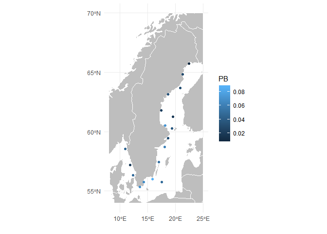
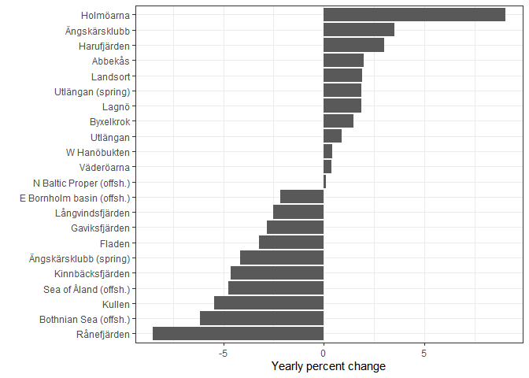

Kursen Statistisk databehandling är användbar om man vill arbeta med
data

``` r
library(tidyverse)
data <- read_csv("metals.csv", guess_max = 5000) # Innehåller metaller från och med 2007
glimpse(data)
```

    ## Observations: 2,243
    ## Variables: 23
    ## $ ACCNR   <chr> "C07/04480", "C07/04481", "C07/06455", "C07/06456", "C...
    ## $ YEAR    <dbl> 2007, 2007, 2007, 2007, 2007, 2007, 2007, 2007, 2007, ...
    ## $ SPECIES <chr> "Herring", "Herring", "Herring", "Herring", "Herring",...
    ## $ LOC     <chr> "Väderöarna", "Väderöarna", "Utlängan", "Utlängan", "U...
    ## $ LAT     <dbl> 58.54930, 58.54930, 56.00808, 56.00808, 56.00808, 56.0...
    ## $ LONG    <dbl> 10.96442, 10.96442, 15.83090, 15.83090, 15.83090, 15.8...
    ## $ NHOM    <dbl> NA, NA, NA, NA, NA, NA, NA, NA, NA, NA, NA, NA, NA, NA...
    ## $ ALDR    <dbl> 2, 2, 4, 4, 5, 4, 4, 3, 4, 4, 4, 4, 4, 4, 4, 4, 4, 4, ...
    ## $ TOTL    <dbl> 20.5, 22.1, 18.2, 17.8, 17.7, 17.7, 18.2, 17.8, 18.4, ...
    ## $ TOTV    <dbl> 66.8, 84.1, 36.0, 36.3, 33.0, 30.1, 69.4, 68.4, 71.1, ...
    ## $ FPRC    <dbl> 4.36, 4.36, 1.17, 1.74, 1.37, 0.60, 0.83, 0.76, 0.73, ...
    ## $ PB      <dbl> 0.043, 0.049, 0.050, 0.086, 0.095, 0.081, -0.008, -0.0...
    ## $ CD      <dbl> 0.43, 0.56, 1.48, 1.36, 3.17, 1.38, 1.28, 0.46, 0.42, ...
    ## $ CU      <dbl> 13, 14, 13, 16, 16, 15, 12, 14, 10, 13, 13, 13, 8, 7, ...
    ## $ ZN      <dbl> 83, 87, 98, 91, 83, 98, 94, 114, 106, 115, 107, 97, 92...
    ## $ NI      <dbl> -0.08, -0.08, -0.11, 0.13, 0.23, -0.24, -0.08, -0.08, ...
    ## $ CR      <dbl> -0.01, -0.02, -0.02, -0.02, -0.03, -0.05, -0.02, -0.02...
    ## $ AG      <dbl> 0.03, 0.01, 0.02, 0.03, 0.02, 0.02, 0.03, 0.01, 0.01, ...
    ## $ AS      <dbl> 7.81, 10.90, 1.82, 2.33, 2.77, 2.07, 2.90, 3.60, 3.09,...
    ## $ AL      <dbl> NA, NA, NA, NA, NA, NA, NA, NA, NA, NA, NA, NA, NA, NA...
    ## $ SE      <dbl> NA, NA, NA, NA, NA, NA, NA, NA, NA, NA, NA, NA, NA, NA...
    ## $ SN      <dbl> NA, NA, NA, NA, NA, NA, NA, NA, NA, NA, NA, NA, NA, NA...
    ## $ HG      <dbl> 21, 22, 23, 125, 18, 37, 37, 75, 43, 39, 50, 59, 62, 4...

Här är `ACCNR` museets id-nummer i samlingarna. Homogenat känns igen
genom att de innehåller ett bindestreck, t.ex. `C12/03302-03313`. `NHOM`
är antalet individer i ett homogenat (oftast `NA` om det är en individ).
`FATPRC` är procent fett i vävnaden och `PB`-`HG` är koncentrationer av
metaller (om koncentrationen är under detektionsgränsen \(x\) anges
värdet \(-x\)). Övriga variabler borde vara självförklarande. För vissa
arter (musslor och fågelägg) saknas t.ex. ålder. De olika arterna är,
med respektive antal obs

``` r
table(data$SPECIES) %>% knitr::kable()
```

| Var1                   | Freq |
| :--------------------- | ---: |
| Blue mussel            |  468 |
| Cod                    |  166 |
| Common tern            |    7 |
| Eelpout                |   50 |
| Eurasian Oystercatcher |    7 |
| Guillemot              |  120 |
| Herring                | 1166 |
| Perch                  |  259 |

Vi kan bestämma årsvisa geometriska medelvärden med

``` r
geomean <- function(x) exp(mean(log(x), na.rm = TRUE))
fix_loq <- function(x) ifelse(x < 0, abs(x) / sqrt(2), x) # Byter LOQ mot LOG/sqrt(2)

agg_data <- data %>% 
  mutate_at(vars(PB:HG), fix_loq) %>% 
  group_by(LOC, YEAR, SPECIES, LAT, LONG) %>% 
  summarise_at(vars(PB:HG), geomean) %>% 
  ungroup()
head(agg_data)
```

    ## # A tibble: 6 x 17
    ##   LOC    YEAR SPECIES   LAT  LONG     PB    CD    CU    ZN     NI     CR
    ##   <chr> <dbl> <chr>   <dbl> <dbl>  <dbl> <dbl> <dbl> <dbl>  <dbl>  <dbl>
    ## 1 Abbe~  2007 Herring  55.3  13.6 0.0643 0.899 10.5   71   0.0673 0.0100
    ## 2 Abbe~  2008 Herring  55.3  13.6 0.0534 0.702  8.00  80.5 0.105  0.0141
    ## 3 Abbe~  2009 Herring  55.3  13.6 0.0742 1.01   9.54  81.6 0.0714 0.0245
    ## 4 Abbe~  2010 Herring  55.3  13.6 0.0870 2.23  12.5   80.0 0.242  0.0424
    ## 5 Abbe~  2011 Herring  55.3  13.6 0.0555 1.03   7.94  81.5 0.125  0.0424
    ## 6 Abbe~  2012 Herring  55.3  13.6 0.0500 1.16  10.5   87.5 0.150  0.0387
    ## # ... with 6 more variables: AG <dbl>, AS <dbl>, AL <dbl>, SE <dbl>,
    ## #   SN <dbl>, HG <dbl>

och plotta t.ex. bly i torsklever

``` r
agg_data %>% filter(SPECIES == "Cod") %>% 
  ggplot(aes(x = YEAR, y = PB)) + geom_point() + geom_line() + facet_wrap(~LOC) + theme_bw()
```

<!-- -->

eller det senaste värdet för strömming på en karta

``` r
library(rnaturalearth)
library(rnaturalearthdata)
library(sf)
world_map <- ne_countries(scale = "medium", returnclass = "sf") %>% 
  st_crop(c(xmin=8, xmax=25, ymin=54, ymax=70))
```

    ## Warning: attribute variables are assumed to be spatially constant
    ## throughout all geometries

``` r
ggplot(world_map) + geom_sf(color = "white", fill = "grey") + 
  geom_point(data = filter(agg_data, SPECIES == "Herring", YEAR == 2018), aes(x = LONG, y = LAT, color = PB)) +
  theme_minimal() + xlab("") + ylab("")
```

<!-- -->

Vi kan anpassa en linjär regression till koncentrationen bly i strömming
vid varje lokal

``` r
lm_fits <- agg_data %>% 
  filter(SPECIES == "Herring") %>% 
  group_by(LOC) %>% 
  nest() %>% 
  mutate(fit = map(data, ~lm(log(PB) ~ YEAR, data = .x))) %>% 
  ungroup()
head(lm_fits)
```

    ## # A tibble: 6 x 3
    ##   LOC                                  data fit   
    ##   <chr>                     <list<df[,16]>> <list>
    ## 1 Abbekås                         [12 x 16] <lm>  
    ## 2 Bothnian Sea (offsh.)           [11 x 16] <lm>  
    ## 3 Byxelkrok                       [12 x 16] <lm>  
    ## 4 E Bornholm basin (offsh.)        [4 x 16] <lm>  
    ## 5 Fladen                          [12 x 16] <lm>  
    ## 6 Gaviksfjärden                   [12 x 16] <lm>

och t.ex. visualisera trenderna

``` r
lm_fits %>% mutate(slope = map_dbl(fit, ~coef(.x)["YEAR"]),
                   trend = (exp(slope) - 1)*100,
                   LOC = fct_reorder(LOC, trend)) %>% 
  ggplot(aes(x = LOC, y = trend)) + geom_col() + 
  coord_flip() + theme_bw() + ylab("Yearly percent change") + xlab("")
```

<!-- -->
